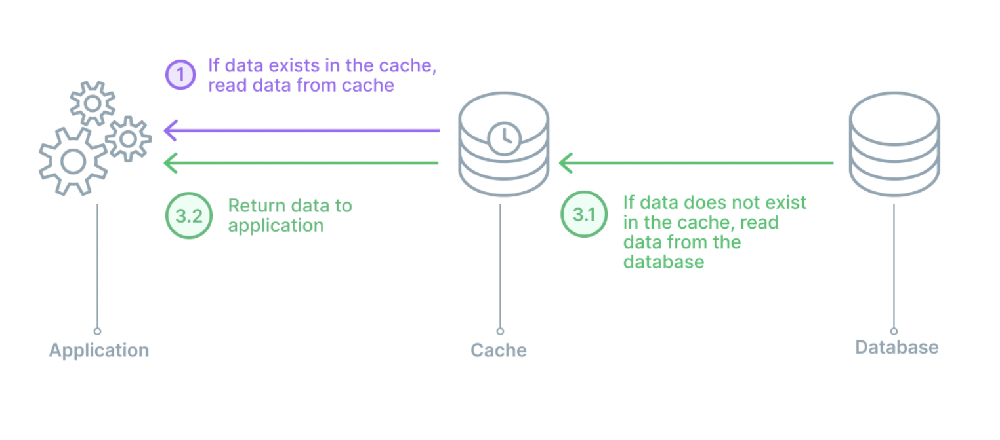
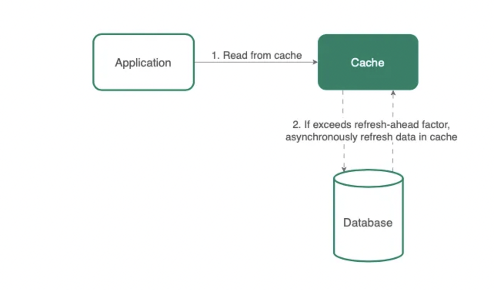
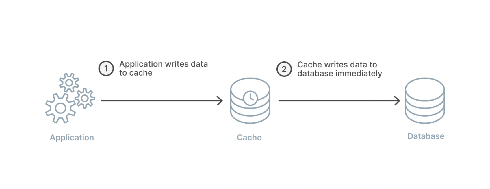
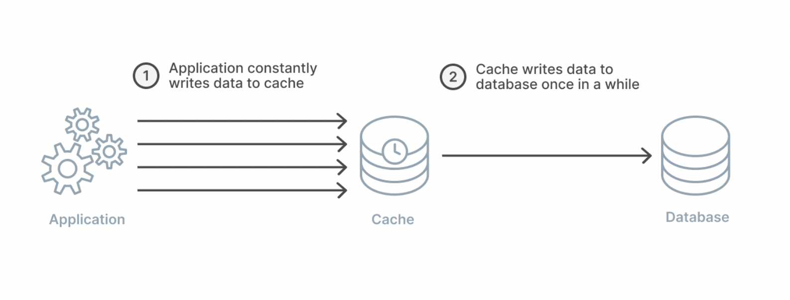
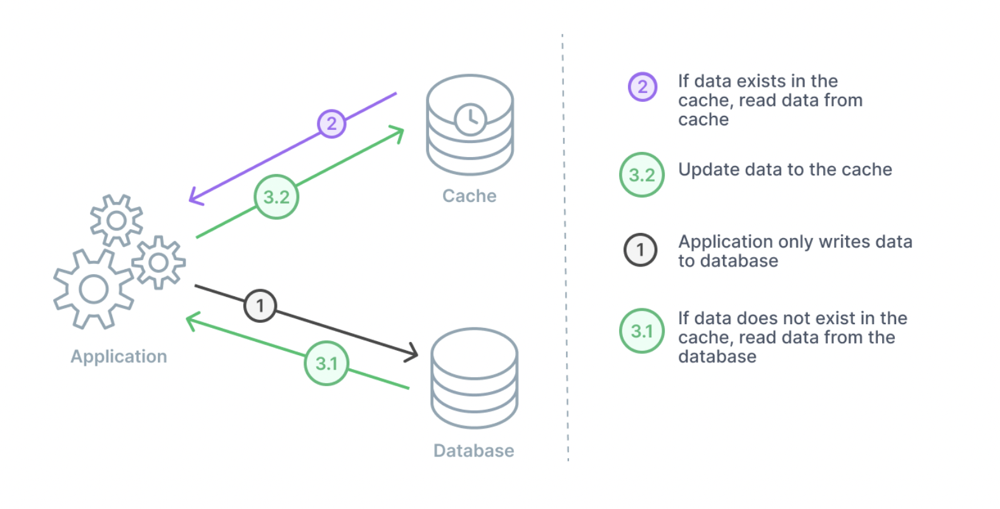
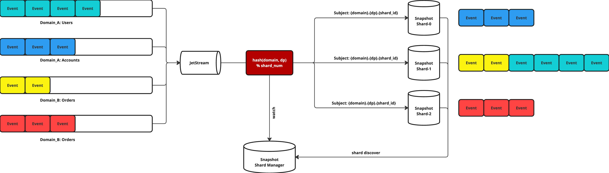
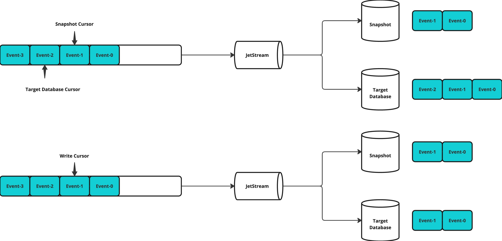

<!-- vscode-markdown-toc -->
* 1. [衡量 Cache 的指標](#Cache)
* 2. [Read Intensive Application Caching](#ReadIntensiveApplicationCaching)
* 3. [Pattern: Cache-aside](#Pattern:Cache-aside)
* 4. [Pattern: Read-through](#Pattern:Read-through)
* 5. [Pattern: Refresh-ahead](#Pattern:Refresh-ahead)
* 6. [Write Intensive Application Caching](#WriteIntensiveApplicationCaching)
* 7. [Pattern: Write-through](#Pattern:Write-through)
* 8. [Pattern: Write-back](#Pattern:Write-back)
* 9. [Pattern: Write-around](#Pattern:Write-around)
* 10. [Cache Invalidation Methods](#CacheInvalidationMethods)
* 11. [Gravity & Cache 設計](#GravityCache)
	* 11.1. [Gravity 特性](#Gravity)
	* 11.2. [架構](#)
	* 11.3. [Read/Write API](#ReadWriteAPI)
		* 11.3.1. [Read](#Read)
		* 11.3.2. [Write](#Write)
	* 11.4. [討論: Sync vs. Async](#:Syncvs.Async)

<!-- vscode-markdown-toc-config
	numbering=true
	autoSave=true
	/vscode-markdown-toc-config -->
<!-- /vscode-markdown-toc --># Cache System
主要依照 [6-Caching Strategies to Remember while designing Cache System](https://javascript.plainenglish.io/6-caching-strategies-to-remember-while-designing-cache-system-da058a3757cf) 為基礎，做相關的研究和整理。

##  1. <a name='Cache'></a>衡量 Cache 的指標
要衡量 Cache 主要可以透過以下的指標來衡量。
* Cache hit ratio
* Latency
* Throughput
* Cache size
* Cache miss rate

##  2. <a name='ReadIntensiveApplicationCaching'></a>Read Intensive Application Caching
專門用來處理大量讀的優化，像是 Wordpress 之類的網站，常見的有以下 Policy
* Cache-aside
* Read-through
* Refresh-ahead

##  3. <a name='Pattern:Cache-aside'></a>Pattern: Cache-aside
這篇文章對 Cache-aside 的介紹不太夠，參考 Facebook 論文 [Scaling Memcache at Facebook](https://www.usenix.org/system/files/conference/nsdi13/nsdi13-final170_update.pdf)，裡面有對 Cache-aside 詳細的介紹。


執行 Cache-aside 的 Policy 如圖所示:
1. Read 時會先檢查 Cache 有沒有存相對應的 Key-Value
    * Hit: 直接回傳 Cache 的資料
    * Miss: 去 Read Database，並且回填 Cache
2. Write 的時候會執行以下步驟
    * Update 資料庫
    * 刪除 Cache 裡面的資料

我認為比較值得注意的是，Write 的時候會清掉 Cache 的內容，這可以一定程度避免資料 stale 的問題，我們把回填 Cache 的方式交給 Read 去執行。基本上這種 Policy 是十分常見的，目前為止 (2021 年的論文) Twitter 還是採用這種方法 [A Large-scale Analysis of Hundreds of In-memory Key-value Cache Clusters at Twitter](https://dl.acm.org/doi/10.1145/3468521)。

這種方式可以讓 Application Server 的邏輯保持透明性，Cache 不需要實作複雜的邏輯，只要提供 ```Get()```, ```Set()```, ```Del()``` 等方法即可。

##  4. <a name='Pattern:Read-through'></a>Pattern: Read-through


Read-through 則遵循以上原則:
1. 當 Read 發生時，一樣先去 Cache 找尋
    * Hit: 直接回傳 Cache 的資料
    * Miss: 則由 Cache 發起 Read

Read-through 和 Cache-aside 最大的差別是將 Read Database 的邏輯從 Application Server 轉移到 Cache 上，


##  5. <a name='Pattern:Refresh-ahead'></a>Pattern: Refresh-ahead

Refresh-ahead 算是 Asynchronous 版本的 Read-through，遵循以下 Policy。

1. 需要決定兩個數值 
    * Expiration time: Cache 過期的時間
    * Refresh-ahead factor: 更新比率
2. 舉例來說
    * Expiration time: 60 sec
    * Refresh-ahead factor: 0.5
3. 每 30 秒會 Read Database 來更新 Cache 的內容。

##  6. <a name='WriteIntensiveApplicationCaching'></a>Write Intensive Application Caching
* Write-through
* Write-back
* Write-around


##  7. <a name='Pattern:Write-through'></a>Pattern: Write-through


Write-through 遵守以下 Policy
1. Write 發生時
    * 先寫入 Cache
    * 由 Cache 同步寫入 Database


##  8. <a name='Pattern:Write-back'></a>Pattern: Write-back


Write-back 遵守以下 Policy:

1. Write 發生時
    * 先寫入 Cache
2. Asynchronous 更新 Database
    * Batch Write，一次性寫入多筆的 Wrtie

Write-back 可以用 Batch 優化寫入的效能，但是需要額外實作 Cache Failure 的情境。

##  9. <a name='Pattern:Write-around'></a>Pattern: Write-around


Write-around 可視為 cache-aside 和 read-through 的結合，遵守以下 Policy: 

1. 當 Write 發生時
    * 先更新 Database
    * Asynchronous 更新 Cache

Write-around 是用的情境是只有一次性的 Write，而且不更新，甚至不太有 Read 的發生。

##  10. <a name='CacheInvalidationMethods'></a>Cache Invalidation Methods
* TTL: 時間過期
* Event-based: 發送事件
* Version-based: 用 MVCC 的概念，建立多個版本的 Cache Value
* LRU: LRU 演算法 
* Manual: 手動刪除

##  11. <a name='GravityCache'></a>Gravity & Cache 設計


###  11.1. <a name='Gravity'></a>Gravity 特性
根據 Dispatcher 的設計，所有的 Event 會針對 Domain 和 Data Product 分門別類，例如:
* Domain A
    * Data Product W
        * event, event, event ...
    * Data Product X
        * event, event, event ...
* Domain B
    * Data Product Y
        * event, event, event ...
* Domain C
    * Data Product Z
        * event, event, event ...

以上的 Event store 有包含了隱形的 Concurrency Control，舉例來說:
* Domain A 的 Data Product W 所有的 events
* Domain B 的 Data Product B 所有的 events
* Domain C 的 Data Product Z 所有的 events

都是互相獨立，Gravity 並沒有 Multi-records Transaction，所以不用考慮這種 Case，也就是說不同的 Data Product，可以不需要考慮 Concurrency Control，只需要在 Data Product Level 保持 Sequential 的處理即可。

###  11.2. <a name=''></a>架構


根據以上的特性，可以設計 Snapshot 的架構，用 (domain, dataproduct) 作為 shard key，可以確保不需要經過網路溝通就可以做 Scan，除此之外也可以 Horizontal Scale。

###  11.3. <a name='ReadWriteAPI'></a>Read/Write API
####  11.3.1. <a name='Read'></a>Read
Snapshot Read 會是以 Data Product 為基礎，也就是要支援以下兩種 Read API:
* ```/dataproducts/:dp```: Single Point Query
* ```/dataproducts/```: Scan Query

####  11.3.2. <a name='Write'></a>Write
則是 Single-Consumer 寫入 Sorted Map 的 Database，例如:
* BadgerDB
* RocksDB
* Pebble
* Redis

###  11.4. <a name=':Syncvs.Async'></a>討論: Sync vs. Async


實作上面臨兩個選項，如果要同時實作 
* Gravity Snapshot
* 資料庫抄寫

會面臨到兩個問題，兩者的 State 要不要同步?

圖上顯示 Snapshot 和 Target Database 分別維護各自的 cursor，圖下則是共用同一個 cursor，同時寫入兩個可以同步 State，但是會有較高的 Latency，反之則是較低的 Latency，但是不保證 Snapshot 和 Target Database 的一致性。


